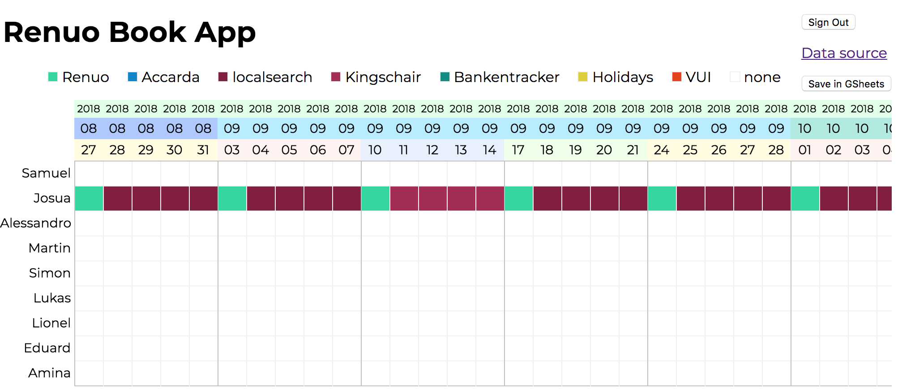

# Renuo Book App

We have to plan our developers assignments to our customers way in advance.
In the past we used Teambookapp for this task. But Teambookapp can do much more;
too much for our needs. Therefore we thought it would be useful to have the
following by our own.

You can select cells and assign projects to your workers. The state is persisted in a Google Sheet.

## Configuration

Set up a Google Sheets table with 2 tabs:

"Projects" looks like this:

| Project    | Color   |
| ---------- | ------- |
| Renuo      | #26d79d |
| Customer 1 | #ff0000 |
| Customer 2 | #00ff00 |

"Assignments" looks like this:

| Date \ Name | Samuel     | Josua      |
| ----------- | ---------- | ---------- |
| 2018-08-27  | Renuo      | Renuo      |
| 2018-08-28  | Customer 1 | Customer 2 |
| 2018-08-29  | Customer 1 | Customer 2 |

**Constraints**

* Dates have to start on a Monday
* The sheet should skip weekends so that a week has five days (can be done with `=WORKDAY($A2, 1)`).

# Copyright

2018 Renuo AG under AGPLv3
